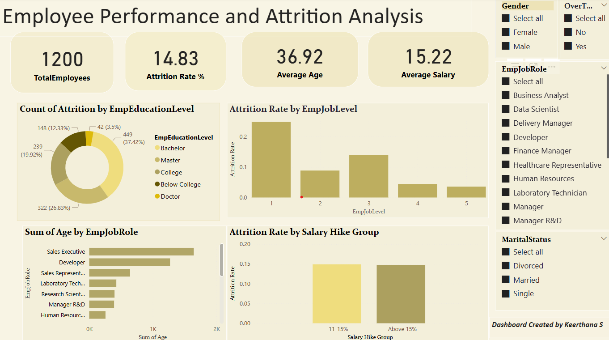

# 📊 Employee Performance Analysis - Power BI Dashboard

This interactive Power BI dashboard provides deep insights into factors contributing to employee performance and attrition. The dashboard helps identify underlying causes of poor performance and offers a visual narrative to assist HR and management in making informed decisions.

---

## 🎯 Project Objective

To analyze employee performance data and uncover the core factors driving attrition, dissatisfaction, and underperformance across various departments and roles. The dashboard serves as a tool for HR analytics and strategic decision-making.

---

## ❓ Key Business Questions (KPIs)

- 📘 Does educational level contribute to employee attrition?
- 👥 Which age group shows the highest attrition rate?
- 📌 Are employees unsatisfied with specific job roles?
- 🔝 Which top 5 job roles indicate maximum attrition?
- 🧠 Are highly experienced individuals more likely to leave?
- 💰 How does the percentage of salary hike affect attrition rates?

---

## 📁 Dataset Used
➡️ *Note: This dataset is for educational and portfolio purposes only.*

---

## ⚙️ Project Process

- 🔍 **Data Cleaning & Transformation**: Performed in Power BI using Power Query Editor (e.g., null value handling, data type formatting).
- 🛠️ **Custom Visualizations**: Created bar charts, pie charts, donut charts, clustered bar charts, maps, slicers, and interactive tables.
- 🧮 **DAX Measures**: Developed key performance indicators using DAX to calculate attrition percentage, average salary hike, and job role-based metrics.
- 📊 **Dashboard Design**: Built an intuitive layout with dynamic filters and slicers for deep data exploration.
- 🎨 **Thematic Styling**: Used consistent color palettes and tooltips for better UX and readability.

---

## 🖼️ Dashboard Preview
**🔍 Visual Overview:** Key trends and patterns from employee performance analysis.

---

## 🧠 Insights Gained

- Higher attrition was found among younger employees and certain job roles.
- A lack of salary hike and career growth opportunities led to dissatisfaction.
- Employees with higher experience were also leaving, indicating poor engagement or mismatched roles.
- Educational background showed a moderate influence on attrition behavior.

---

## 🙋‍♂️ Author

**Keerthana S**  
*Data Scientist | Power BI Developer*  
Feel free to reach out for feedback or collaboration opportunities.
